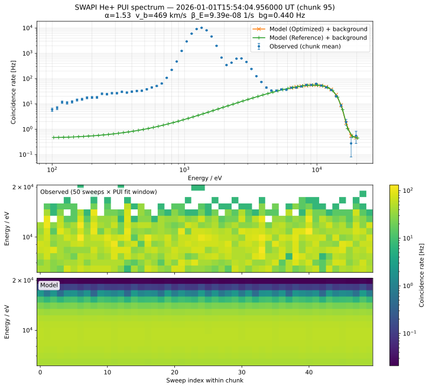
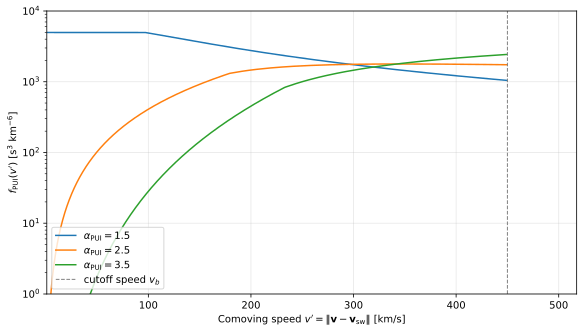
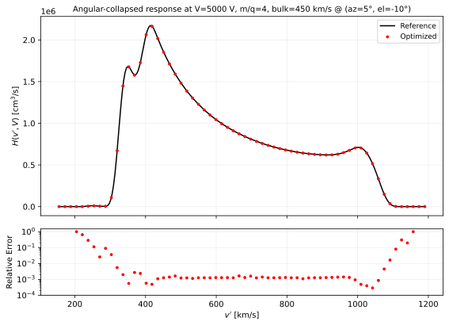
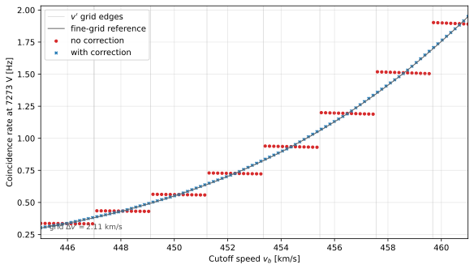
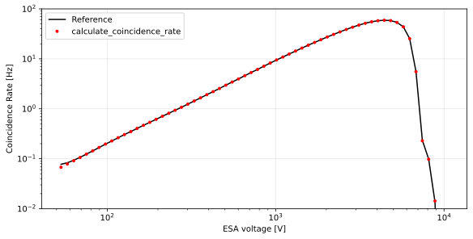

# SWAPI Pickup Ion L3A Data Product

## Introduction

After [fitting the proton distribution](./proton-sw.md) to the ten five-sweep chunks in a ten-minute chunk, the pickup ion (PUI) parameters are evaluated from the 50 sweeps by fitting a forward model. Since the count rates are quite low, Poisson maximum likelihood estimation is used to avoid a biased fit.
See the below figure for an example of the data used for the fit together with the fitted PUI forward model.



*Generated by `uv run scripts/swapi/view_one_pui_spectrum.py 2026-01-01 15:54:05 --output-path docs/swapi/figures/pui_flight_xarray_comparison.svg`, after running `scripts/swapi/fit_and_plot_pui.py 2026-01-01` to populate the fit caches.*

## Distribution Function

The PUI model is a generalized filled-shell distribution for PUIs at position $(r, \psi)$ in the solar inertial frame ([Rankin et al. 2025](https://doi.org/10.1007/s11214-025-01229-8)):
```math
f_\text{PUI}\!\left( r, \psi, w \right)
    = \frac{\alpha_{\text{PUI}}}{4\pi}
      \cdot
      \frac{\beta_{E} r_E^2}{r v_\text{sw} v_{b}^3}
      \cdot
      w^{\alpha_{\text{PUI}} - 3}
      \cdot
      n (r w^{\alpha_{\text{PUI}}}, \psi)
      \cdot
      \Theta(1 - w),
```
The free parameters are:

* Cutoff speed $v_{b}$.
* Cooling index $\alpha_{\text{PUI}}$.
* Ionization rate $\beta_{E}$.

The additional terms are:

* $`v_\text{sw}`$ is the solar wind speed in the inertial frame.
* $`w_k \equiv v'/v_{b}`$, where $`v' \equiv \|\mathbf{v} - \mathbf{v}_\text{sw}\|`$ is the speed in the solar-wind frame.
* $n(r, \psi)$ is the density of interstellar neutrals, precomputed in a lookup table ancillary file using the hot model of [Thomas (1978)](https://doi.org/10.1146/annurev.ea.06.050178.001133).
* $r_E \approx 1\,\text{au}$.

Below, we show examples of the distribution for various cooling indices.
> 
> 
> *Generated by `docs/swapi/figure_src/plot_pui_distribution.py`.*

> **Note**: The low-speed asymptote for low cooling index is because the $n(r, \psi)$  LUT currently only has down to 0.1 au.

The PUI density and temperature are recovered as velocity moments of the fitted distribution,
```math
n_\text{PUI} = 4\pi \int_0^{v_\text{cut}} v'^{\,2} \, f_\text{PUI}(v') \; \mathrm{d}v',
\qquad
T_\text{PUI} = \frac{m}{3 k_B}
  \frac{\int_0^{v_\text{cut}} v'^{\,4} \, f_\text{PUI}(v') \; \mathrm{d}v'}
       {\int_0^{v_\text{cut}} v'^{\,2} \, f_\text{PUI}(v') \; \mathrm{d}v'}.
```

## Model Inputs

The PUI fitting procedure is applied to ten-minute chunks, each chunk containing fifty 12-second sweeps, each sweep having 72 ESA steps.
The [proton model](./proton-sw.md) is fit to each one-minute chunk within the ten-minute chunk and then the mean of the fitted proton parameters is used to inform the PUI model.

For each sweep $i \in \{1, \dots, 50\}$ and step $j \in \{1, \dots, 62\}$, the PUI fitting procedure takes:
- ESA voltage $V_j$;
- Measured coincidence rate $C_{ij}$;
- Chunk-mean proton solar wind bulk velocity vector rotated from RTN to instrument coordinates $\mathbf{v}_{\text{sw},ij}$.

For PUIs, only the coarse steps are used, and the ESA steps are trimmed to the following range based on the theoretical cutoff energy ([Rankin et al. 2025](https://doi.org/10.1007/s11214-025-01229-8)):
```math
1.25 \, E_\text{cut}(\mathrm{H^+}) \;<\; k_\text{L2}V_j \;<\; 1.2 \, E_\text{cut}(\mathrm{He^+}).
```

## Collapsed Instrument Response

To model the coincidence rate requires integrating the product of the differential flux with [the instrument response](./response.md):
```math
C_\text{PUI}(V) = \int \text{d}^3v \thinspace  v \thinspace  f_\text{PUI}(\mathbf{v})  \mathcal{A}^{s}(\mathbf{v}, V).
```

$`f_\text{PUI}`$ is isotropic in the solar wind's comoving frame (where $\mathbf{v}_\text{sw} = 0$).
Thus, one can change variables $`\mathbf{u} \equiv \mathbf{v} - \mathbf{v}_\text{sw}`$ ($`\mathrm{d}^3v = \mathrm{d}^3u`$, $`v' = |\mathbf{u}|`$), using $`\mathrm{d}^3u = v'^{\,2}\,\mathrm{d}v'\,\mathrm{d}\omega_u`$ ($\int \mathrm{d}\omega_u = 4\pi$), resulting in the 1D integral 
```math
C_\text{PUI}(V) = \int_0^\infty v'^{\,2}\,\mathrm{d}v' \; f_\text{PUI}(v') \, H(v', V; \mathbf{v}_\text{sw}),
```
where
```math
H(v', V; \mathbf{v}_\text{sw}) \;\equiv\; \int \mathrm{d}\omega_{u} \; |\mathbf{v}|\, \mathcal{A}(\mathbf{v}, V)
```
is the angular integral of $`|\mathbf{v}|\,\mathcal{A}`$ on the spherical shell defined by $`|\mathbf{v}-\mathbf{v}_\text{sw}|=v'`$, with dimensions of volume per time.
We can convert the angular integral to a velocity integral as follows:
```math
H(v', V; \mathbf{v}_\text{sw}) = \int \mathrm{d}^3 v \; \frac{\delta(v' - \| \mathbf{v} - \mathbf{v}_\text{sw} \|)}{v'^2} \, |\mathbf{v}|\, \mathcal{A}(\mathbf{v}, V)
```

In spherical instrument coordinates:
```math
H(v', V; \mathbf{v}_\text{sw}) = \int \mathrm{d}v \, \mathrm{d}\theta \, \mathrm{d}\phi \; v^3 \cos\theta \; \frac{\delta(v' - \| \mathbf{v} - \mathbf{v}_\text{sw} \|)}{v'^2} \, \mathcal{A}(\mathbf{v}, V)
```

To make this integral easier to calculate, we can fix $v'$ and integrate over two coordinates from $(\theta, \phi, v)$.
We choose to integrate over $(\theta, v)$ so that we only need to interpolate the passband once for each region.

The term inside the delta function is satisfied when:
```math
v'^2
= v^2 + v_\text{sw}^2 - 2 v v_\text{sw} \cos\alpha,
```
where $\alpha$ denotes the angle between $\mathbf{v}$ and $\mathbf{v}_\text{sw}$, given by:
```math
\cos\alpha = \frac{v^2 + v_\text{sw}^2 - v'^2}{2 v v_\text{sw}}
= \sin\theta \sin \theta_b + \cos\theta \cos\theta_b \cos(\phi - \phi_b).
```

Solving for the $\phi$ term:
```math
\cos(\phi - \phi_b) = \frac{\cos\alpha - \sin\theta \sin\theta_b}{\cos\theta \cos\theta_b},
```
which has zero or two solutions (depending on whether the right-hand side lies in $[-1, 1]$):
```math
\phi_\pm = \phi_b \pm \arccos\!\left( \frac{\cos\alpha - \sin\theta \sin\theta_b}{\cos\theta \cos\theta_b} \right)
```
(The boundary case where the argument equals $\pm 1$ yields a single (degenerate) root $\phi_+ = \phi_-$ but can be ignored for integration purposes.)

Define $`R(\phi) \equiv \|\mathbf{v} - \mathbf{v}_\text{sw}\|`$ at fixed $(v, \theta)$. 
Using $`\delta(v' - R(\phi)) = \sum_\pm \delta(\phi - \phi_\pm) / |R'(\phi_\pm)|`$, the integral is reduced to:
```math
H(v', V; \mathbf{v}_\text{sw}) = \int \mathrm{d}v \int \mathrm{d}\theta \; \frac{v^3 \cos\theta}{v'^{\,2}} \sum_\pm \frac{\mathcal{A}(v, \theta, \phi_\pm, V)}{|R'(\phi_\pm)|}.
```
Differentiating $`R^2(\phi) = v^2 + v_\text{sw}^2 - 2 v v_\text{sw} \cos\alpha(\phi)`$ with respect to $\phi$ gives
```math
2 R(\phi)\, R'(\phi) = 2\, v\, v_\text{sw} \cos\theta \cos\theta_b \sin(\phi - \phi_b),
```
and $R(\phi_\pm) = v'$,
```math
|R'(\phi_\pm)| = \frac{v\, v_\text{sw} \cos\theta \cos\theta_b\, |\sin(\phi_\pm - \phi_b)|}{v'}.
```
Substituting $|R'(\phi_\pm)|$ into the integral:
```math
H(v', V; \mathbf{v}_\text{sw}) = \int \mathrm{d}v \int \mathrm{d}\theta \; \frac{v^2}{v_\text{sw}\, v' \cos\theta_b} \sum_\pm \frac{\mathcal{A}(v, \theta, \phi_\pm, V)}{|\sin(\phi_\pm - \phi_b)|},
```

Below, we compare this optimized calculation of $H$ to a direct shell quadrature integral.



*Generated by `docs/swapi/figure_src/plot_collapsed_response_grid.py`.*

## Numerical Integration

The integration weight tensor $W_{ijk}$
```math
W_{ijk} = \Delta v' \cdot {v'_k}^2 \cdot H(v'_k, V_j; \mathbf{v}_\text{sw,ij}).
```
is precomputed on a uniform grid $v'_k \in [v'_\text{min}, v'_\text{max}]$ with spacing $\Delta v'$, defined by
```math
v'_\text{min} = \max\!\left(1\ \text{km/s},\; 0.8\,v_\text{sw}\,\frac{r_\text{min}}{r}\right),
```
```math
v'_\text{max} = 1.2 v_\text{sw},
```
where $r_\text{min}$ is the minimum $r$ in the $n(r, \psi)$ lookup table.
The boundaries are chosen based on the minimum and maximum cutoff speed in the fitting bounds.

Using $W_{ijk}$, the model coincidence rate is given by
```math
C_{ij}^\text{(model)}(\mathbf{x}) = C_\text{bg} + \sum_k W_{ijk} f_\text{PUI}(v'_k; \mathbf{x}),
```
a single tensor operation after evaluating $`f_\text{PUI}(v'_k; \mathbf{x})`$ on the grid only one time for all sweeps and steps.

It is essential to ensure continuity in derivatives with respect to the cutoff speed $v_b$ despite the discrete grid so that uncertainties can be estimated.
The numerical integration setup is equivalent to a midpoint rule, so $v'_j$ represents the bin center.
Instead of evaluating the Heaviside step function when calculating $`f_\text{PUI}`$ based on $\Theta(v'_j - v_b)$ alone, it is applied based on the fraction of the cutoff bin that is within the cutoff.
The exact index of the bin containing the cutoff point is
```math
j_\text{cutoff} = \text{round}\left( \dfrac{v_b - v'_0}{\Delta v'} \right).
```
The fraction of this bin that is below the cutoff is
```math
\dfrac{v_b - \left( v'_{j=j_\text{cutoff}} - \frac{\Delta v'}{2} \right)}{\Delta v'}.
```
Therefore, we simply scale $f_\text{PUI}$ in the cutoff bin by that factor, and set bins above the cutoff to zero. The below plot confirms that this approach accurately corrects the cutoff discretization even at an ESA voltage that is strongly affected by the cutoff.


*Generated by `docs/swapi/figure_src/plot_pui_cutoff_staircase.py`.*


Below, the optimized 1D integral is validated by comparing it to a reference 3D integral with automatic handling of units via `pint` and dimensionality using `xarray`.



*Generated by `docs/swapi/figure_src/plot_pui_reference_comparison.py` from `tests/test_data/swapi/pui_count_rate_reference.csv`.*

## Optimization Strategy

The PUI parameters to be determined are $\mathbf{x} = (\alpha_\text{PUI}, \beta_E, v_b, C_\text{bg})$.
To enable the application of physical constraints on the parameters, the constrained optimization problem in $\mathbf{x}$ is posed as an unconstrained problem in $\tilde{x}$, given by
```math
\tilde{\mathbf{x}} = \arcsin\!\left( \dfrac{2 (\mathbf{x} - \mathbf{x}_\text{min})}{\mathbf{x}_\text{max} - \mathbf{x}_\text{min}} - 1 \right),
```
with bounds defined in the table below.
| Parameter | $`x_\text{min}`$ | $`x_\text{max}`$ | Initial |
|---|---|---|---|
| $\alpha_\text{PUI}$ | 1.0 | 5.0 | 1.5 |
| $\beta_E$ | $0.6 \times 10^{-9}$ s⁻¹ | $8 \times 10^{-7}$ s⁻¹ | $10^{-7}$ s⁻¹ |
| $v_b$ | $0.8 \, v_\text{sw}$ | $1.2 \, v_\text{sw}$ | $v_\text{sw}$ |
| $C_\text{bg}$ | 0 | 10 Hz | 0.1 Hz |

The Nelder-Mead method is used for optimization, with a heuristic five-vertex simplex specified explicitly  .

The optimal parameters are estimated by maximizing the Poisson likelihood—yielding optimal parameters $`\hat{\mathbf{x}}`$—through minimization of
```math
\hat{\mathbf{x}} = \arg\min_{\mathbf{x}} \sum_{i,j} C^\text{(model)}_{ij}(\mathbf{x}) - C_{ij} \ln{C^\text{(model)}_{ij}(\mathbf{x})}.
```

The covariance matrix of $`\hat{\tilde{\mathbf{x}}}`$ is estimated using the inverse of the Hessian of the negative log likelihood function,
```math
\Sigma_{\tilde{\mathbf{x}}} = \bigl[ \nabla^2 \mathcal{L}(\hat{\tilde{\mathbf{x}}}) \bigr]^{-1},
```
and then the covariance matrix for the PUI parameters $`\mathbf{x}`$ is given by

```math
\Sigma_{\mathbf{x}} = \text{J} \, \Sigma_{\tilde{\mathbf{x}}} \, \text{J}^\top,
```
where $J = \partial \mathbf{x}/\partial \tilde{\mathbf{x}}$.

## Failure Cases

When $C_\text{bg}$ is higher than 1 Hz, a fill value is reported for $C_\text{bg}$ because of the probable influence of suprathermal populations, but the other parameters are kept.

If the uncertainty estimation fails (suggesting that the solution is not a minimum), or the coefficient of determination $R^2$ is less than 0.9 for the sweep-averaged coincidence rates in the fitting window, then the `BAD_FIT` flag is set and fill values are reported. 

## Numerical Test

Shown below is an experiment validating that the fitting algorithm recovers the ground truth parameters and accurately estimates the uncertainty given an ideal model with Poisson noise added.


*Generated by `docs/swapi/figure_src/plot_pui_mc_validation.py` from `tests/test_data/swapi/pui_count_rate_reference_50sweep.h5`.*
