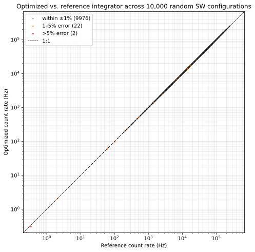

# SWAPI Solar Wind Forward Model

## Integration Method

### Integral

The solar wind velocity distribution function (VDF) is modeled as a drifting Maxwellian
```math
f^{p}(\mathbf{v}; \mathbf{x}) = \frac{n}{(\sqrt{2\pi}\thinspace  v_{\text{th}})^{3}} \exp\negthinspace \left(-\frac{|\mathbf{v} - \mathbf{v}_{b}|^{2}}{2 v_{\text{th}}^{2}}\right) = \frac{n}{(\sqrt{2\pi}\thinspace  v_{\text{th}})^{3}} \exp\negthinspace \left(-\frac{v^{2} - 2\thinspace v\thinspace (\hat{\mathbf{d}}\cdot\mathbf{v}_{b}) + v_{b}^{2}}{2 v_{\text{th}}^{2}}\right),
```
with density $`n`$, $`v_{\text{th}} = \sqrt{k_{B} T/m_{p}}`$ ($`T`$ being temperature), and bulk velocity $`\mathbf{v}_{b} = (v_{R}, v_{T}, v_{N})^{\top}`$ in the spacecraft RTN frame.
The flow direction in RTN coordinates, $`\hat{\mathbf{d}}(\theta, \phi)`$, is obtained by applying the measurement-specific rotation matrix to
```math
\hat{\mathbf{d}}^{\text{XYZ}}(\theta, \phi)
\equiv \dfrac{\mathbf{v}}{\|\mathbf{v}\|}

= \bigl(-\cos\theta \sin\phi,\thinspace  -\cos\theta \cos\phi,\thinspace  -\sin\theta\bigr)^{\top}.
```

Substituting the VDF into the [coincidence rate integral](./response.md):
```math
C(V;n,v_\text{th},\mathbf{v}_b) = \frac{n\thinspace  \mathcal{A}_{0}(V)}{(\sqrt{2\pi}\thinspace  v_{\text{th}})^{3}} \sum_{\text{region}}
   \int \mathrm{d}\theta \cos\theta
   \int \mathrm{d}\phi \; T(\phi)
   \int \mathrm{d}v \; v^{3}\thinspace  P\negthinspace \left(\dfrac{v}{v_{0}(V)}, \theta\right) \exp\negthinspace \left(-\frac{v^{2} - 2\thinspace v\thinspace (\hat{\mathbf{d}}(\theta, \phi)\cdot\mathbf{v}_{b}) + v_{b}^{2}}{2 v_{\text{th}}^{2}}\right).
```

The region sum includes the sunglasses (SG, $`|\phi| \leq 20°`$) and the two sides of the open aperture (OA±, $`20° \leq |\phi| \leq 150°`$).


Each region is integrated using nested Gauss-Legendre quadrature with fixed numbers of integration points:
```math
(N_{\theta}, N_{\phi}, N_{v}) = (21,\thinspace 21,\thinspace 15).
```

### Speed Limits

The speed integral is limited to the overlap between the passband's speed width and the VDF-driven interval 
```math
[v_{b} - \Delta v_{\text{VDF}},\thinspace  v_{b} + \Delta v_{\text{VDF}}], \qquad \Delta v_{\text{VDF}} = 6v_{\text{th}},
```
where $`v_{b} = |\mathbf{v}_{b}|`$ and $`v_{\text{th}}`$ is the thermal speed.

The integral is skipped early if there is no overlap with the conservative range $`[0.9v_{0},\thinspace 1.1v_{0}]`$.
Otherwise, using the passband's integration contour, denoted
```math
[r_{\text{min}}(\theta)v_{0},\thinspace  r_{\text{max}}(\theta)v_{0}],
```
the speed limits at a given elevation are given by
```math
v_{\text{lo}}(\theta) = \max\negthinspace \left(v_{b} - \Delta v_{\text{VDF}},\thinspace  r_{\text{min}}(\theta)v_{0}\right),
```
```math
v_{\text{hi}}(\theta) = \min\negthinspace \left(v_{b} + \Delta v_{\text{VDF}},\thinspace  r_{\text{max}}(\theta)v_{0}\right).
```
Any $\theta$ where $`v_{\text{hi}}(\theta) \leq v_{\text{lo}}(\theta)`$ is skipped.

### Angular Limits

The angular extent of the VDF's extent within a factor of $`\varepsilon = 10^{-6}`$ is given by
```math
\Delta\alpha = \arccos\negthinspace \left(\mathrm{clamp}\negthinspace \left(\frac{v_{\text{th}}^{2} \ln\varepsilon}{v_{0} v_{b}} + 1;\thinspace  -1,\thinspace  1\right)\right),
```
The window is centered on the bulk-flow direction in the instrument frame.
For measurement $`i`$, this direction is computed from $`\mathbf{v}_{b,i}^{\text{XYZ}} = R_{i}^{\top} \mathbf{v}_{b}`$ ([Rankin et al. 2025](https://doi.org/10.1007/s11214-025-01229-8)):
```math
\phi_{b,i} = \mathrm{arctan2}(-v_{b,i,x}^{\text{XYZ}},\thinspace  -v_{b,i,y}^{\text{XYZ}}), \qquad \theta_{b,i} = \arcsin\negthinspace \left(-\frac{v_{b,i,z}^{\text{XYZ}}}{v_{b}}\right).
```
These angles define only the integration limits; the Maxwellian exponent still uses the RTN-frame dot product $`\hat{\mathbf{d}}_{i} \cdot \mathbf{v}_{b}`$ directly.
For each measurement, they give the rectangular window
```math
[\theta_{b,i} - \Delta\alpha,\thinspace  \theta_{b,i} + \Delta\alpha] \times [\phi_{b,i} - \Delta\alpha,\thinspace  \phi_{b,i} + \Delta\alpha],
```
which is then clamped to the passband elevation range and azimuth range for the region.
The azimuthal region is skipped if the window is clamped to zero.

For OA±, the azimuth window is further reduced with a 64-point scan of the azimuth-only integrand, approximated as
```math
h(\phi) = T(\phi)\exp\negthinspace \left[-\frac{v_{0}^{2} + v_{b}^{2} - 2v_{0}v_{b}\cos\alpha(\theta_{b}', \phi)}{2v_{\text{th}}^{2}}\right],
```
where $`v = v_{0}`$, $`\theta_{b}'`$ is the bulk elevation clamped into the OA passband's elevation range, and $`\alpha(\theta_{b}', \phi)`$ is the angle with respect to to the bulk flow direction.
The reduced window includes the range where $`h(\phi) > 10^{-6}\max h`$ padded by one sample on each side.
The OA integral is skipped if the heuristic estimate of its contribution to the total integral
```math
\frac{n\thinspace \mathcal{A}_{0}(V)}{(\sqrt{2\pi}\thinspace v_{\text{th}})^{3}}\thinspace v_{0}^{3}\thinspace \Delta\theta\thinspace \Delta v\thinspace \int_{\phi_{\text{lo}}}^{\phi_{\text{hi}}} h(\phi)\thinspace \mathrm{d}\phi,
```
is below $`\max(0.1\thinspace \text{Hz},\thinspace  10^{-3} C_{\text{SG}})`$.
Here $`\Delta\theta`$ is the clamped OA elevation width (in units of radians) and $`\Delta v = (r_{\text{max}}(0) - r_{\text{min}}(0))v_{0}`$ is the passband width at $`\theta = 0`$.

## Deadtime Correction

The detector deadtime is $`\tau = 183.7\ \text{ns}`$. Following Tsoulfanidis (1995), p. 74, the true count rate $`n`$ and measured rate $`g`$ are related by $`n = g / (1 - g\tau)`$. Rearranged for the forward model, the true model rate $`C^{\text{model}}`$ is mapped to the predicted observed rate before computing residuals:
```math
C^{\text{observed}}_{i} = \frac{C^{\text{model}}_{i}}{1 + \tau\thinspace  C^{\text{model}}_{i}} = C^{\text{model}}_{i} \cdot \mathcal{D}_{i}, \qquad \mathcal{D}_{i} \equiv \frac{1}{1 + \tau\thinspace  C^{\text{model}}_{i}}.
```
This deadtime correction is often non-negligible. It reaches 5% at $`C \approx 2.7\times 10^{5}\ \text{Hz}`$, a routine value for high-flux solar wind.

## Validation

The optimized integrator is validated against a high-resolution fixed-limit reference integrator with a much denser grid and no dynamic integration limits.
The figure below compares the two integrators for a sample of solar wind configurations.


*Generated by `docs/swapi/figure_src/plot_spectra.py`.*

For a thorough validation experiment, the optimized integrator is compared with the fixed-grid reference across 10,000 solar wind cases drawn from WIND/SWE 2-min data in 2025.
The integrals are calculated at the $V$ where $v_0(V) = v_b$, which is approximately the location of the peak coincidence rate.
The vast majority of the time, the relative error is less than 1\%.
And under all situations where the solar wind is in the field of view, the error is less than 5\%.



*Generated by `docs/swapi/figure_src/plot_validation_scatter.py`.*


## Analytic Jacobian

Since $`C(V)`$ is linear in $`f^{p}(\mathbf{v}; \mathbf{x})`$ and $`\mathcal{A}(\mathbf{v}, V)`$ is independent of $`\mathbf{x}`$,
```math
\frac{\partial C(V)}{\partial x_{j}} = \frac{\partial}{\partial x_{j}}\int \mathrm{d}^3v \thinspace v\thinspace f^{p}(\mathbf{v}; \mathbf{x})\thinspace \mathcal{A}(\mathbf{v}, V) = \int \mathrm{d}^3v\thinspace v\thinspace \frac{\partial f^{p}}{\partial x_{j}}(\mathbf{v}; \mathbf{x})\thinspace \mathcal{A}(\mathbf{v}, V).
```
Thus, the same integral used for $`C`$ can evaluate all five columns of the Jacobian in one pass.

To evaluate $`\partial f^{p}/\partial x_{j}`$ for each component of $`\mathbf{x}`$, it is useful to have the logarithm of the VDF, which is
```math
\ln f^{p} = \ln n - \tfrac{3}{2}\ln v_{\text{th}}^{2} - \frac{|\mathbf{v} - \mathbf{v}_{b}|^{2}}{2\thinspace v_{\text{th}}^{2}} + \text{const}.
```
Expanding the squared offset, $`|\mathbf{v} - \mathbf{v}_{b}|^{2} = v^{2} - 2\thinspace v\thinspace (\hat{\mathbf{d}}\cdot\mathbf{v}_{b}) + v_{b}^{2}`$, where $`\hat{\mathbf{d}}`$ is the look direction in RTN..

### Log Density

```math
\frac{\partial f^{p}}{\partial n} = \frac{f^{p}}{n}.
```

Converting to log-space via $`\partial f^{p}/\partial \ln n = n\thinspace \partial f^{p}/\partial n`$,
```math
\frac{\partial f^{p}}{\partial \ln n} = f^{p}.
```

### Log Temperature

```math
\frac{\partial \ln f^{p}}{\partial v_{\text{th}}^{2}} = -\frac{3}{2\thinspace v_{\text{th}}^{2}} + \frac{|\mathbf{v} - \mathbf{v}_{b}|^{2}}{2\thinspace v_{\text{th}}^{4}}.
```

The remaining steps are three applications of the same change-of-variables identity,
```math
\frac{\partial g}{\partial y} = \frac{\partial g}{\partial x}\cdot\frac{\partial x}{\partial y},
```
in the sequence $`v_{\text{th}}^{2} \to T`$ ($`v_{\text{th}}^{2} = k_{B} T/m`$), $`\ln f^{p} \to f^{p}`$, and $`T \to \ln T`$.

First:
```math
\frac{\partial \ln f^{p}}{\partial T} = \frac{\partial v_{\text{th}}^{2}}{\partial T} \cdot \frac{\partial \ln f^{p}}{\partial v_{\text{th}}^{2}} = \frac{v_{\text{th}}^{2}}{T}\thinspace \frac{\partial \ln f^{p}}{\partial v_{\text{th}}^{2}} = \frac{1}{T} \cdot \left(\frac{|\mathbf{v} - \mathbf{v}_{b}|^{2}}{2\thinspace v_{\text{th}}^{2}} - \tfrac{3}{2}\right).
```

Then:
```math
\frac{\partial f^{p}}{\partial T} = \frac{f^{p}}{T}\cdot\left(\frac{|\mathbf{v} - \mathbf{v}_{b}|^{2}}{2\thinspace v_{\text{th}}^{2}} - \tfrac{3}{2}\right).
```

Finally:
```math
\frac{\partial f^{p}}{\partial \ln T} = f^{p}\cdot\left(\frac{|\mathbf{v} - \mathbf{v}_{b}|^{2}}{2\thinspace v_{\text{th}}^{2}} - \tfrac{3}{2}\right).
```

> Note that the sign reverses across $`|\mathbf{v} - \mathbf{v}_{b}|^{2} = 3\thinspace v_{\text{th}}^{2}`$: increasing $`T`$ decreases $`f^{p}`$ for $`v \approx v_{b}`$ and increases it for $`v \gg v_{b}`$.

### Bulk Velocity Components

```math
\nabla_{\mathbf{v}_{b}}\ln f^{p} = -\frac{1}{v_{\text{th}}^{2}}\thinspace \nabla_{\mathbf{v}_{b}}\negthinspace \left[\tfrac{1}{2}|\mathbf{v} - \mathbf{v}_{b}|^{2}\right] = \frac{1}{v_{\text{th}}^{2}}\thinspace (\mathbf{v} - \mathbf{v}_{b}).
```
Multiplying by $`f^{p}`$,
```math
\nabla_{\mathbf{v}_{b}} f^{p} = \frac{f^{p}}{v_{\text{th}}^{2}}\thinspace (\mathbf{v} - \mathbf{v}_{b}).
```
So the three components are
```math
\frac{\partial f^{p}}{\partial v_{R}} = \frac{f^{p}}{v_{\text{th}}^{2}}\thinspace (\mathbf{v} - \mathbf{v}_{b})_{R}, \qquad \frac{\partial f^{p}}{\partial v_{T}} = \frac{f^{p}}{v_{\text{th}}^{2}}\thinspace (\mathbf{v} - \mathbf{v}_{b})_{T}, \qquad \frac{\partial f^{p}}{\partial v_{N}} = \frac{f^{p}}{v_{\text{th}}^{2}}\thinspace (\mathbf{v} - \mathbf{v}_{b})_{N}.
```

### Deadtime Correction

Because deadtime depends on $`C^{\text{model}}`$, it propagates into the residual Jacobian by the chain rule. Differentiating $`C^{\text{observed}} = C^{\text{model}}/(1 + \tau\thinspace C^{\text{model}})`$ with respect to $`C^{\text{model}}`$ via the quotient rule,
```math
\frac{\partial C^{\text{observed}}}{\partial C^{\text{model}}} = \frac{(1+\tau\thinspace C^{\text{model}}) - C^{\text{model}}\cdot\tau}{(1+\tau\thinspace C^{\text{model}})^{2}} = \frac{1}{(1+\tau\thinspace C^{\text{model}})^{2}} = \mathcal{D}^{2}.
```
Thus, the Jacobian columns $`\partial C^{\text{model}}_{i}/\partial x_{j}`$ are scaled by $`\mathcal{D}_{i}^{2}`$ to obtain:
```math
\frac{\partial C^{\text{observed}}_{i}}{\partial x_{j}} = \frac{\partial C^{\text{observed}}_{i}}{\partial C^{\text{model}}_{i}}\cdot\frac{\partial C^{\text{model}}_{i}}{\partial x_{j}} = \mathcal{D}_{i}^{2} \cdot \frac{\partial C^{\text{model}}_{i}}{\partial x_{j}}.
```