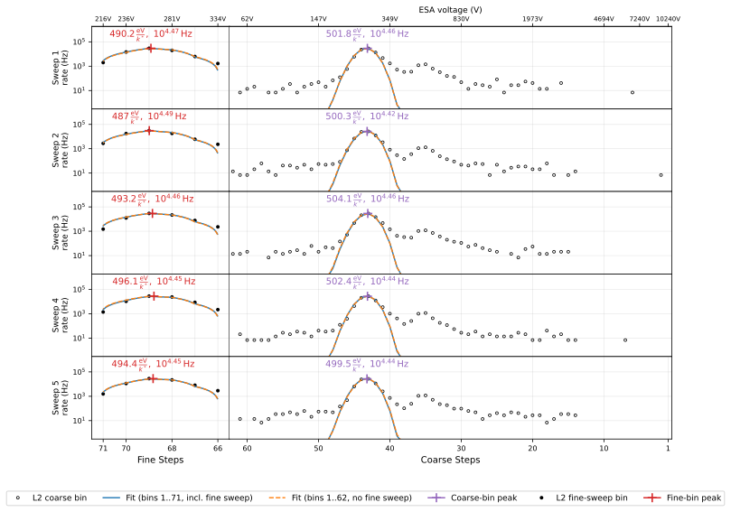
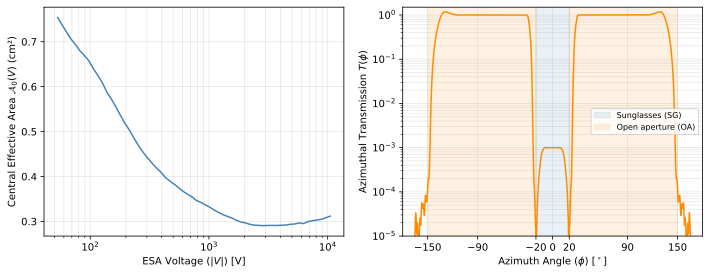
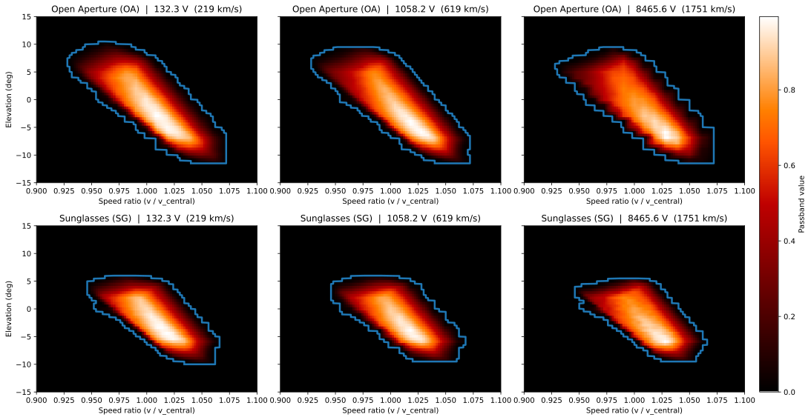
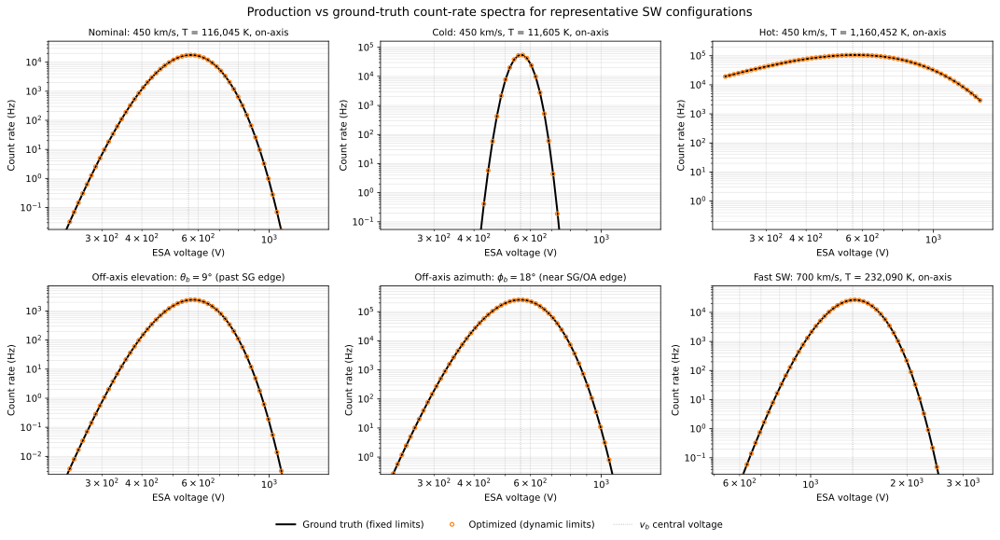
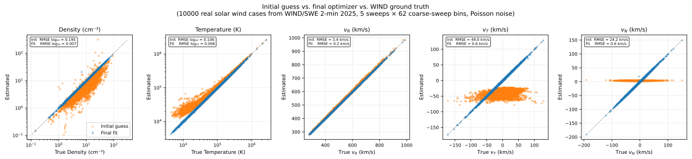
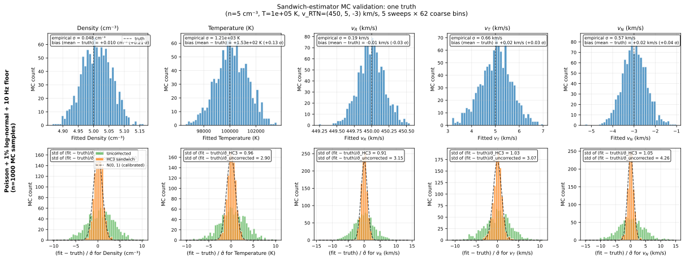
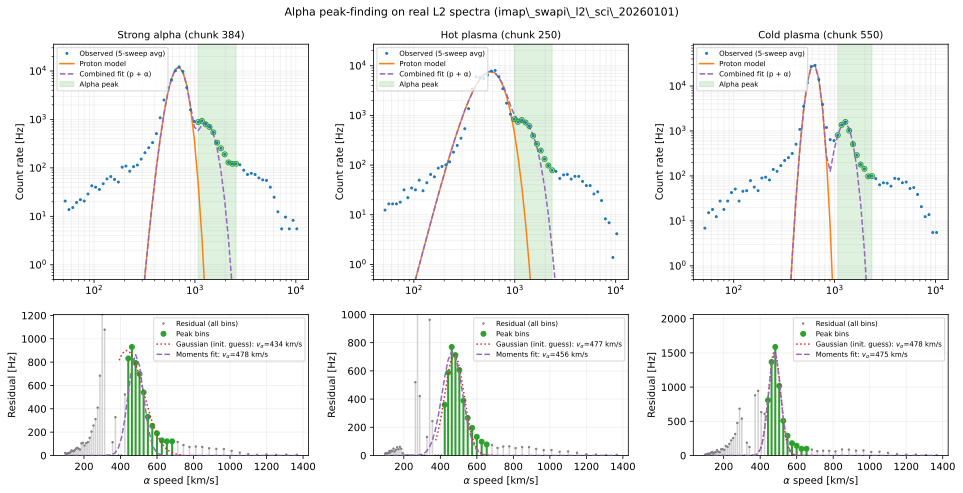

# SWAPI Solar Wind Moments Algorithm Notes

## Introduction

The SWAPI instrument on IMAP measures coincidence count rates as a function of the ESA voltage that selects ions at a given energy-per-charge. Each 12-second ESA sweep contains 72 voltage steps spanning ~50 V to ~10 kV (covering proton and alpha solar-wind energies, plus the pickup-ion shoulder). The L3A `proton-sw` pipeline groups 5 consecutive sweeps into a 60-second chunk and fits a Maxwellian proton VDF — yielding density $`n`$, temperature $`T`$, and the three components of the bulk velocity $`\mathbf{v}_{\text{RTN}}`$ — convolved through SWAPI's energy/angle response and the deadtime correction. This document describes that pipeline end-to-end: the inputs, the forward model, the optimization, and the per-fit uncertainty estimate reported in the L3A CDF.

To set the stage, here is one representative chunk from `imap_swapi_l2_sci_20260201_v001.cdf` (sweeps 6853–6857, center 22:50:14 UT, slow ~308 km/s wind). The figure below shows the measured count rate at each of the 72 ESA steps for all 5 sweeps and on the 5-sweep average. Two forward-modeled spectra are overlaid: the production fit (orange — uses all 71 science bins, including the high-resolution fine-sweep block 63–71) and a coarse-only variant (blue — drops the fine sweep). Both forward models closely track the data on every sweep:



The fitted moments and their 1σ uncertainties are:

<!-- BEGIN: real_data_table (auto-generated by docs/swapi/figure_src/plot_real_data_fit.py — do not edit by hand) -->
| Quantity | SWAPI all bins (HC3 σ) | SWAPI all bins (boot σ) | SWAPI coarse only (HC3 σ) | WIND/SWE 2-min @ 22:49:48 UT |
|---|---:|---:|---:|---:|
| Density $`n`$ (cm⁻³) | 5.122 ± 0.094 | ± 0.099 | 5.091 ± 0.134 | 5.710 ± 0.053 |
| Temperature $`T`$ (K) | $`(1.741 \pm 0.069)\times10^{4}`$ | $`\pm 0.074\times10^{4}`$ | $`(1.757 \pm 0.101)\times10^{4}`$ | $`(2.096 \pm 0.41)\times10^{4}`$ |
| Inertial-frame $`\lvert v \rvert`$ (km/s) | 307.1 ± 0.26 | ± 0.28 | 307.3 ± 0.34 | 333.6 ± 6.40 |
| $`v_{R}`$ (km/s, inertial RTN) | 307.06 ± 0.26 | ± 0.27 | 307.18 ± 0.41 | +333.30 ± 6.40 |
| $`v_{T}`$ (km/s, inertial RTN) | +3.71 ± 1.30 | ± 1.32 | +6.07 ± 2.20 | +12.70 ± 1.00 |
| $`v_{N}`$ (km/s, inertial RTN) | -2.81 ± 1.37 | ± 1.39 | -3.79 ± 1.81 | -0.30 ± 1.00 |
<!-- END: real_data_table -->

The two SWAPI fits agree on every moment to well within their uncertainties.
The reported HC3 uncertainties come from an approximate covariance matrix.
The `boot σ` column reports an independent $`B = 300`$ nonparametric statistical bootstrap as a cross-check.

The corresponding WIND/SWE ~2-min sample at 22:49:48 UT reports a faster, denser, hotter wind. WIND's velocity components are computed from its published GSE values via the L1-frame approximation $`v_{R} \approx -V_{x,\text{GSE}},\thinspace  v_{T} \approx -V_{y,\text{GSE}},\thinspace  v_{N} \approx V_{z,\text{GSE}}`$.
Differences between the spacecraft measurements include systematic effects such as spatial separation and temporal variation of the solar wind.

*The figure and table are generated by `docs/swapi/figure_src/plot_real_data_fit.py`.*

## Input Data

### L2 Science Data

The primary input for `SwapiProcessor` is SWAPI L2 coincidence count-rate data (`imap_swapi_l2_sci`). Each CDF contains time-ordered ESA sweeps with fields:

- `swp_coin_rate` — coincidence count rate (Hz) for each ESA step.
- `esa_energy` — energy-per-charge setting for each ESA step. It is related to the instrument's actual ESA voltage setting by $`k_{\text{L2}} = 1.93`$ eV/V/e.
- `sci_start_time` — sweep start epoch (TT2000 ns)

#### ESA steps

Each 12-second ESA sweep contains **72 ESA steps** (indices 0–71). Their roles are:

| Indices | # Steps | Description |
|---------|-------|-------------|
| 0       | 1     | **Always discarded.** Voltage ramp-up step. |
| 1–62    | 62    | **Coarse steps.** Fixed ESA voltage steps with logarithmic spacing. These steps are ordered from high to low voltage. |
| 63–71   | 9     | **Fine steps.** Instrument mode dependent, but usually provides a higher-resolution scan of the proton peak, using smaller voltage steps. |

To fit protons, we use both the coarse and fine steps, since the fine steps are usually concentrated near the proton peak.
To fit alphas, we use only the coarse steps.

Occasionally, one or more fine steps will have zero ESA voltage; these are excluded from the fit.

#### Cadence

The CDF provides these 12-second sweeps for one day per file.
`SwapiProcessor` groups sweeps into non-overlapping 5-sweep chunks (60 s cadence), the least common multiple of the spin rate (approximately 15 s) and the sweep cadence (12 s).

Using 5 sweeps makes it possible to determine the solar-wind bulk velocity.
The solar-wind fitting algorithms operate on these 5-sweep chunks independently.

### SPICE Kernels

The processor requires SWAPI-to-RTN rotation matrices (one per ESA step) and IMAP's velocity in the Sun's reference frame from the SPICE kernels. The forward model uses the rotation to express look directions defined in instrument coordinates in the spacecraft RTN frame.

The start time for each sweep, available from the L2 CDF, is denoted $`t_{\text{start}}`$.
For ESA step $`i`$ (0-indexed, although recall that step 0 is skipped), the measurement time is:
```math
t_{i} = t_{\text{start}} + i \cdot \tfrac{12}{72}\thinspace \text{s} = t_{\text{start}} + i \cdot 0.1\overline{6}\thinspace \text{s}.
```

### MAG RTN (alpha only)

The alpha moments depend on the local magnetic field direction because the alpha-proton drift is constrained to lie along the direction of the magnetic field ($`\hat{\mathbf{B}}`$).

#### L2 vs L1D
The dependency loader prefers MAG L2 and falls back to L1D when no L2 file is available. MAG is required for `alpha-sw`; the processor raises `ValueError` if neither product is provided, matching SWE's dependency loader behavior.

When L1D is the source, every alpha-sw chunk in the run has its `PRELIMINARY_MAG` bit set so the product can be flagged for reprocessing once L2 is available. `proton-sw` and `pui-he` do not consume MAG.

#### Averaging scheme

For each 5-sweep alpha chunk, the processor uses the full $`60\thinspace \text{s}`$ MAG window $`[\thinspace t_{\text{center}} - 30\thinspace \text{s},\thinspace  t_{\text{center}} + 30\thinspace \text{s})`$.
The in-window RTN samples are averaged directly, and the mean vector is normalized to produce $`\hat{\mathbf{B}}^{\text{RTN}}`$.

#### Missing values

If $`\hat{\mathbf{B}}^{\text{RTN}}`$ cannot be computed because there are no non-fill values within the window, the moments for that chunk are assigned fill values.

## SWAPI Response Model

The coincidence count rate at ESA voltage $`V`$ is
```math
C(V) = \sum_{s} \int d^3v \thinspace  v \thinspace  f^{s}(\mathbf{v}) \thinspace  \mathcal{A}^{s}(\mathbf{v}, V),
```
where $`f^{s}`$ is the VDF of species $`s`$ and $`\mathcal{A}^{s}`$ is the effective area.

#### Effective area decomposition

$`\mathcal{A}^{s}`$ is decomposed as
```math
\mathcal{A}^{s}(v, \theta, \phi, V) = \mathcal{A}_{0}^{s}(V) \cdot P\negthinspace \left(\dfrac{v}{v_{0}^{s}},\thinspace  \theta,\thinspace  \phi,\thinspace  V\right) \cdot \mathcal{T}(\phi),
```
where:
- $`v_{0}^{s} = \sqrt{2 k^{\ast} q^{s} |V| / m^{s}}`$ is the central speed;
- $`\mathcal{A}_{0}^{s}`$ is the central effective area;
- $`P`$ is the energy-angle passband;
- $`\mathcal{T}`$ is the azimuthal transmission factor.

CSV versions of these three functions are in `instrument_team_data/swapi`.

#### Normalization point

The normalizations of $`\mathcal{A}_{0}^{s}`$ and $`P`$ are aligned in terms of the value at $`\theta = 0`$ and $`k^{\ast} \equiv 1.89`$ eV/V/e, the peak $`E/|V|`$ at $`\theta=0^{\circ}`$ based on high-resolution SIMION simulations.

$`k^{\ast}`$ differs from $`k_{\text{L2}} = 1.93 eV/V/e`$, which is the $`k`$-factor estimated pre-launch from lab measurements (Rankin et al. 2025).
They differ primarily because of small inaccuracies in the beam energy and orientation in the lab measurements.

#### Tabulated form and grid construction

`SwapiResponse` holds the in-memory representation of the three components of the response function: $`\mathcal{T}(\phi)`$, $`\mathcal{A}_{0}^{s}(V)`$, and the passband fit coefficients for $`P`$.

$`\mathcal{T}(\phi)`$ and $`\mathcal{A}_{0}^{s}(V)`$ are 1D functions stored in simple CSV files. $`\mathcal{T}`$ is sampled at 0.1° spacing in $`|\phi|`$; $`\mathcal{A}_{0}^{s}`$ is sampled on the CSV voltage grid.
Both are interpolated linearly between samples.
$`\mathcal{A}_{0}^{s}`$ is clamped to its endpoints outside the tabulated voltage range.

> 
> *Central effective area and azimuthal transmission.* [[src]](figure_src/plot_calibration_curves.py)

$`P`$ at a given $`V`$ is represented as a `PassbandGrid` object.
The CSV file contains quadratic polynomial fits of $`\log P`$ for each ($`\theta`$, $`v/v_{0}`$) pixel as a function of $`\log(k^{\ast} |V|)`$. Open aperture ($`|\phi| > 20°`$) and sunglasses ($`|\phi| \leq 20°`$) have separate fits.

The central effective area is scaled using `EfficiencyCalibrationTable`, which stores detection efficiencies $`\varepsilon`$ for each species as a function of time.
For protons, we scale it by ${\varepsilon_{p}(t)}/{\varepsilon_{p}(t_{\text{lab}})}$, where $\varepsilon_{p}(t_{\text{lab}})$ is the first proton entry in the table on or after 2025-11-01.
For alphas, we scale it by ${\varepsilon_{\alpha}(t)}/{\varepsilon_{p}(t_{\text{lab}})}$, which accounts for the increased central effective area for alphas compared to protons.

`SwapiResponse.create_passband_grid` evaluates these fits at the requested $`V`$ and resamples the speed-ratio axis onto a uniform grid: $`\theta`$ matches the CSV elevations ($`-15°`$ to $`15°`$ in $`0.5°`$ steps) and $`v/v_{0}`$ is resampled to $`0.9`$ to $`1.1`$ in 101 points. The resulting per-region grids are stored on `PassbandGrid` as `values_open_aperture` and `values_sunglasses` and used for bilinear interpolation in $`(\theta, v/v_{0})`$ inside the integrator. Voltages outside the fitted range are clamped to the nearest endpoint.


> *Example passbands.* [[src]](figure_src/plot_passband_boundaries.py)

`PassbandGrid` also stores the passband region used by the integrator: a per-region elevation range (`oa_elevation_range`, `sg_elevation_range`) bounding the $`\theta`$ integration window, and per-elevation speed-ratio bounds (`min_OA_boundary`, `max_OA_boundary`, `min_SG_boundary`, `max_SG_boundary`) bounding the $`v`$ integration window for each elevation row inside that range.

The integration region is set by a threshold of 1% of that region's grid maximum (computed independently for SG and OA). For each elevation row with at least one above-threshold cell, the speed-ratio bounds are the first speed-ratio pixels just outside the above-threshold region. Rows with no above-threshold cell are omitted.

The elevation range is anchored at the interpolated crossing where the row maximum drops below threshold. Both the speed-ratio bounds and elevation range are recomputed for every $`V`$, since the polynomial fits change shape with voltage.

When an integration elevation falls between stored passband-boundary rows, the wider neighboring interval is used. This avoids clipping the passband between rows.

`SwapiProcessor` precomputes a `PassbandGrid` for each unique ESA voltage in an L2 file once, before fitting any of the 5-sweep chunks.
At fit setup, each ESA voltage step is wrapped in a `ResponseGrid` that bundles the precomputed passband grid with the species-dependent central speed $`v_{0}`$, central effective area, and azimuthal transmission.

## Forward Model

#### Velocity Distribution Function

The solar wind proton velocity distribution function (VDF) is modeled as a drifting Maxwellian, parameterized by the fit parameter vector $`\mathbf{x} = (\ln n,\thinspace  \ln T,\thinspace  v_{R},\thinspace  v_{T},\thinspace  v_{N})`$ — density and temperature in log-space, and bulk velocity $`\mathbf{v}_{b} = (v_{R}, v_{T}, v_{N})^{\top}`$ as linear RTN components. We work entirely in the RTN frame: the integration variable $`\mathbf{v}`$ is the particle velocity in RTN, and the bulk velocity $`\mathbf{v}_{b}`$ is also in RTN. No rotation of $`\mathbf{v}_{b}`$ into the instrument frame is needed at any point in the integral.

The VDF, written as a function of $`\mathbf{v} \in \mathbb{R}^{3}`$:
```math
f^{p}(\mathbf{v}; \mathbf{x}) = \frac{n}{(\sqrt{2\pi}\thinspace  v_{\text{th}})^{3}} \exp\negthinspace \left(-\frac{|\mathbf{v} - \mathbf{v}_{b}|^{2}}{2 v_{\text{th}}^{2}}\right) = \frac{n}{(\sqrt{2\pi}\thinspace  v_{\text{th}})^{3}} \exp\negthinspace \left(-\frac{v^{2} - 2\thinspace v\thinspace (\hat{\mathbf{d}}\cdot\mathbf{v}_{b}) + v_{b}^{2}}{2 v_{\text{th}}^{2}}\right),
```
where $`v = |\mathbf{v}|`$, $`\hat{\mathbf{d}} = \mathbf{v}/v`$ is the flow direction unit vector (in RTN), $`v_{b} = |\mathbf{v}_{b}|`$, and $`v_{\text{th}} = \sqrt{k_{B} T/m_{p}}`$.

The instrument samples $`f^{p}`$ over particle directions naturally defined by instrument-frame elevation and azimuth $`(\theta, \phi)`$. We convert to flow direction from instrument angular look direction coordinates (Rankin et al. 2025) as
```math
\hat{\mathbf{d}}^{\text{XYZ}}(\theta, \phi) = \bigl(-\cos\theta \sin\phi,\thinspace  -\cos\theta \cos\phi,\thinspace  -\sin\theta\bigr)^{\top}
```
and rotate it into RTN using the SWAPI→RTN rotation matrix $`R`$ for the corresponding ESA step:
```math
\hat{\mathbf{d}}(\theta, \phi) = R\thinspace \hat{\mathbf{d}}^{\text{XYZ}}(\theta, \phi).
```

#### Coincidence Rate Integral

Substituting the VDF into the count rate integral in spherical velocity coordinates $`(v, \theta, \phi)`$:
```math
C(V) = \frac{n\thinspace  \mathcal{A}_{0}(V)}{(\sqrt{2\pi}\thinspace  v_{\text{th}})^{3}} \sum_{\text{region}} \int \cos\theta\thinspace  d\theta \int \mathcal{T}(\phi)\thinspace  d\phi \int v^{3}\thinspace  P\negthinspace \left(\tfrac{v}{v_{0}}, \theta\right) \exp\negthinspace \left(-\frac{v^{2} - 2\thinspace v\thinspace (\hat{\mathbf{d}}\cdot\mathbf{v}_{b}) + v_{b}^{2}}{2 v_{\text{th}}^{2}}\right) dv.
```
The $`v^{3}\cos\theta`$ factor comes from the velocity-space volume element $`v^{2}\cos\theta\thinspace dv\thinspace d\theta\thinspace d\phi`$ times the particle speed $`v`$ in the flux term.

### Integration Method

#### Azimuthal Regions

The region sum runs over three azimuth regions: sunglasses (SG, $`|\phi| \leq 20°`$) and the two halves of the open aperture (OA, $`20° \leq |\phi| \leq 150°`$). Each region uses a single passband (SG or OA), and the SG/OA boundary at $`\pm 20°`$ is the natural split since $`\mathcal{T}(\phi)`$ is identically zero there (vanes fully blocking).

#### Quadrature Method

Each region is evaluated as a nested Gauss-Legendre quadrature with a fixed number of integration points:
```math
(N_{\theta}, N_{\phi}, N_{v}) = (21,\thinspace 21,\thinspace 15).
```

The loops are nested $`\theta \to \phi \to v`$, with terms that depend only on outer-loop variables hoisted out of the inner loops.

#### Angular limits

For each azimuth region, the angular cutoff $`\Delta\alpha`$ is chosen from the VDF angular falloff at the passband central speed $`v_{0}`$. At fixed speed $`v`$, the Maxwellian's angular dependence relative to its on-axis value is
```math
\frac{f(v, \alpha)}{f(v, 0)} = \exp\negthinspace \left(\frac{v v_{b} (\cos\alpha - 1)}{v_{\text{th}}^{2}}\right).
```
Setting this ratio to $`\varepsilon`$ at $`v = v_{0}`$ and solving for $`\alpha`$:
```math
\Delta\alpha = \frac{180}{\pi}\arccos\negthinspace \left(\mathrm{clamp}\negthinspace \left(\frac{v_{\text{th}}^{2} \ln\varepsilon}{v_{0} v_{b}} + 1;\thinspace  -1,\thinspace  1\right)\right),
```
with $`\varepsilon = 10^{-6}`$. If the VDF is broad enough that the arccos argument would leave $`[-1, 1]`$, the clamp makes $`\Delta\alpha = 180^{\circ}`$.

The implementation uses this angular cutoff as a rectangular half-extent in instrument-frame elevation and azimuth around the bulk direction:
```math
[\theta_{b} - \Delta\alpha,\thinspace  \theta_{b} + \Delta\alpha] \times [\phi_{b} - \Delta\alpha,\thinspace  \phi_{b} + \Delta\alpha].
```
Here $`(\theta_{b}, \phi_{b})`$ are the elevation and azimuth of the bulk direction expressed in the instrument frame, obtained by mapping $`\mathbf{v}_{b}`$ into instrument coordinates via the SWAPI→RTN matrix transpose: $`\mathbf{v}_{b}^{\text{XYZ}} = R^{\top} \mathbf{v}_{b}`$, then $`\phi_{b} = \mathrm{arctan2}(-v_{b,x}^{\text{XYZ}},\thinspace  -v_{b,y}^{\text{XYZ}})`$ and $`\theta_{b} = \arcsin(-v_{b,z}^{\text{XYZ}}/v_{b})`$. This rectangle is conservative: it contains the angular disk of radius $`\Delta\alpha`$ around the bulk direction.

The window is then clamped to the passband elevation range for the region and to that region's azimuth span:

| Region | Azimuth Range |
|--------|----------------|
| SG     | $`[-20°,\thinspace  20°]`$ |
| OA−    | $`[-150°,\thinspace  -20°]`$ |
| OA+    | $`[20°,\thinspace  150°]`$ |

If either clamped dimension has zero width, that region is skipped.

For OA± only, the azimuth window is trimmed once more using the product of the VDF and azimuthal transmission. `_trim_oa_azimuth_by_integrand` samples 64 points of $`f(v_{0}, \theta_{b}', \phi)\mathcal{T}(\phi)`$ across the clamped OA azimuth window, where $`\theta_{b}'`$ is $`\theta_{b}`$ clamped into the OA elevation range. It keeps the portion above $`10^{-6}`$ of its maximum and expands by one sample on each side.

After this trim, OA $`\pm`$ is skipped when the heuristic upper estimate
```math
\hat{C}_{\text{OA}} = \mathcal{A}_{0}(V)\thinspace v_{0}^{3}\thinspace \Delta\theta\thinspace \Delta v\thinspace \int_{\phi_{\text{lo}}}^{\phi_{\text{hi}}} \mathcal{T}(\phi)\thinspace g(\phi)\thinspace d\phi
```
falls below $`\max(0.1\thinspace \text{Hz},\thinspace  10^{-3} C_{\text{SG}})`$. Here $`g(\phi) = f(v_{0}, \theta_{b}', \phi)`$, $`\Delta\theta`$ is the clamped OA elevation width in radians, and $`\Delta v = (r_{\text{max}}(0) - r_{\text{min}}(0))v_{0}`$ is the OA passband speed width at $`\theta = 0^{\circ}`$.

#### Speed limits

For each Gauss-Legendre elevation node, the speed integral only needs to cover speeds where both of these are true:

1. The VDF is non-negligible.
2. The SWAPI passband is nonzero at that elevation.

The VDF speed interval is taken to be
```math
[v_{b} - \Delta v_{\text{VDF}},\thinspace  v_{b} + \Delta v_{\text{VDF}}], \qquad \Delta v_{\text{VDF}} = 6v_{\text{th}},
```
where $`v_{b} = |\mathbf{v}_{b}|`$ and $`v_{\text{th}}`$ is the thermal speed. For the Maxwellian VDF used here, this captures essentially all of the distribution: at $`6\sigma`$ the radial factor is $`e^{-18} \approx 10^{-8}`$ of peak. A much wider window (e.g., $`10v_{\text{th}}`$) makes Gauss-Legendre concentrate nodes far from the integrand peak for cold plasma where the passband already extends well beyond $`6v_{\text{th}}`$; a much narrower one (e.g., $`3v_{\text{th}}`$) clips the Maxwellian wings too much for off-peak passband alignments.

The passband speed range is stored as speed-ratio bounds relative to the central passband speed $`v_{0}`$:
```math
[r_{\text{min}}(\theta)v_{0},\thinspace  r_{\text{max}}(\theta)v_{0}].
```
Here $`r_{\text{min}}(\theta)`$ and $`r_{\text{max}}(\theta)`$ depend on both elevation and aperture region (SG or OA). They describe where the passband at that elevation remains above the integration cutoff.

The speed integration limits are the intersection of those two windows:
```math
v_{\text{lo}}(\theta) = \max\negthinspace \left(v_{b} - \Delta v_{\text{VDF}},\thinspace  r_{\text{min}}(\theta)v_{0}\right),
```
```math
v_{\text{hi}}(\theta) = \min\negthinspace \left(v_{b} + \Delta v_{\text{VDF}},\thinspace  r_{\text{max}}(\theta)v_{0}\right).
```

If the interval $`[v_{b} - \Delta v_{\text{VDF}},\thinspace  v_{b} + \Delta v_{\text{VDF}}]`$ does not overlap with $`[0.9\thinspace v_{0},\thinspace  1.1\thinspace v_{0}]`$, the integral is skipped early because there it is guaranteed to be zero.

### Integrator Validation

The optimized integrator (`calculate_integral`) is validated against a high-resolution fixed-limit reference integrator (`reference_integral_fixed_limits`) — the same forward model evaluated on a much denser fixed grid with no dynamic integration limits.

The figure below compares the two integrators on six solar wind configurations: cold and hot temperatures, bulk elevation past the SG passband edge, bulk azimuth straddling the SG/OA boundary, and high speed.



*Generated by `docs/swapi/figure_src/plot_spectra.py`.*

For aggregate accuracy, the optimized integrator is evaluated against the same reference integral over 10,000 random solar-wind configurations (`reference_integrals.csv`).
Each configuration is evaluated at the ESA voltage whose central proton speed equals its `bulk_speed`.
The table below summarizes the distribution of $`|\text{ratio} - 1|`$ grouped by reference coincidence rate.

<!-- BEGIN: validation_table (auto-generated by docs/swapi/figure_src/build_validation_table.py — do not edit by hand) -->
| Reference (Hz)  |     N |  Median |     95% |     99% |     Max |
|-----------------|-------|---------|---------|---------|---------|
| $\lt 0.1$       |   228 |  26.25% |  84.63% |  97.49% | 100.00% |
| $0.1$ – $1$     |   239 |   7.07% |  25.48% |  38.48% |  41.93% |
| $1$ – $10$      |   325 |   2.76% |  14.03% |  22.15% |  28.74% |
| $10$ – $10^2$   |   383 |   1.40% |   8.98% |  14.46% |  17.61% |
| $10^2$ – $10^3$ |   525 |   0.81% |   4.56% |   9.46% |  16.15% |
| $10^3$ – $10^4$ |   865 |   0.41% |   2.14% |   5.18% |  11.28% |
| $10^4$ – $10^5$ |  1694 |   0.19% |   0.85% |   1.70% |   3.38% |
| $\geq 10^5$     |  3841 |   0.14% |   0.63% |   0.98% |   2.21% |
<!-- END: validation_table -->
*Generated by `docs/swapi/figure_src/build_validation_table.py`.*

For high-rate cases ($`\geq 10^{3}`$ Hz) where proton-fit residuals are dominated by Poisson noise rather than integrator error, $`|\text{ratio} - 1|`$ stays within a few percent of unity at the 99th percentile. The $`< 0.1`$ Hz band is configurations where the bulk direction sits many sigma outside the FOV — both integrators round to well below SWAPI's noise floor (which varies between 0.1 Hz and 10 Hz, typically closer to 10 Hz), so the ratio is clamped to $`100\%`$.
The worst cases at typical solar wind coincidence rate ($`\geq 10^{4}`$ Hz) are primarily due to bulk flow directions near the edge of the instrument response, which is rare by design because of the alignment of SWAPI's boresight and the spacecraft spin axis with the nominal average solar wind direction.

### Analytic Jacobian

Since $`C(V)`$ is linear in $`f^{p}(\mathbf{v}; \mathbf{x})`$ and $`\mathcal{A}(\mathbf{v}, V)`$ is independent of $`\mathbf{x}`$,
```math
\frac{\partial C(V)}{\partial x_{j}} = \frac{\partial}{\partial x_{j}}\int d^3v\thinspace v\thinspace f^{p}(\mathbf{v}; \mathbf{x})\thinspace \mathcal{A}(\mathbf{v}, V) = \int d^3v\thinspace v\thinspace \frac{\partial f^{p}}{\partial x_{j}}(\mathbf{v}; \mathbf{x})\thinspace \mathcal{A}(\mathbf{v}, V).
```
The same integral used for $`C`$ then delivers all five Jacobian columns in one pass at minimal cost.
The rest of this section derives $`\partial f^{p}/\partial x_{j}`$ for each component of $`\mathbf{x}`$.
Working entirely in the RTN frame (so $`\mathbf{v}`$ and $`\mathbf{v}_{b}`$ are both 3-vectors in RTN), the log of the Maxwellian is
```math
\ln f^{p} = \ln n - \tfrac{3}{2}\ln v_{\text{th}}^{2} - \frac{|\mathbf{v} - \mathbf{v}_{b}|^{2}}{2\thinspace v_{\text{th}}^{2}} + \text{const}.
```
Expanding the squared offset, $`|\mathbf{v} - \mathbf{v}_{b}|^{2} = v^{2} - 2\thinspace v\thinspace (\hat{\mathbf{d}}\cdot\mathbf{v}_{b}) + v_{b}^{2}`$, where $`\hat{\mathbf{d}}`$ is the look direction in RTN at the integration node (built in instrument XYZ from $`(\theta, \phi)`$ and rotated by $`R`$).

#### Density

$`f^{p}`$ is linear in $`n`$, so
```math
\frac{\partial f^{p}}{\partial n} = \frac{f^{p}}{n}.
```

Converting to log-space via $`\partial f^{p}/\partial \ln n = n\thinspace \partial f^{p}/\partial n`$,
```math
\frac{\partial f^{p}}{\partial \ln n} = f^{p}.
```

#### Temperature

$`T`$ enters $`f^{p}`$ only through $`v_{\text{th}}^{2} = k_{B} T/m`$, so we first differentiate with respect to $`v_{\text{th}}^{2}`$ and then convert. From $`\ln f^{p}`$,
```math
\frac{\partial \ln f^{p}}{\partial v_{\text{th}}^{2}} = -\frac{3}{2\thinspace v_{\text{th}}^{2}} + \frac{|\mathbf{v} - \mathbf{v}_{b}|^{2}}{2\thinspace v_{\text{th}}^{4}}.
```
The first term comes from the $`-\tfrac{3}{2}\ln v_{\text{th}}^{2}`$ coefficient; the second from differentiating the exponent's $`1/v_{\text{th}}^{2}`$.

The remaining steps are three applications of the same change-of-variables identity,
```math
\frac{\partial g}{\partial y} = \frac{\partial g}{\partial x}\cdot\frac{\partial x}{\partial y},
```
in the sequence $`v_{\text{th}}^{2} \to T`$, $`\ln f^{p} \to f^{p}`$, and $`T \to \ln T`$.

First:
```math
\frac{\partial \ln f^{p}}{\partial T} = \frac{\partial v_{\text{th}}^{2}}{\partial T} \cdot \frac{\partial \ln f^{p}}{\partial v_{\text{th}}^{2}} = \frac{v_{\text{th}}^{2}}{T}\thinspace \frac{\partial \ln f^{p}}{\partial v_{\text{th}}^{2}} = \frac{1}{T} \cdot \left(\frac{|\mathbf{v} - \mathbf{v}_{b}|^{2}}{2\thinspace v_{\text{th}}^{2}} - \tfrac{3}{2}\right).
```

Then:
```math
\frac{\partial f^{p}}{\partial T} = \frac{f^{p}}{T}\cdot\left(\frac{|\mathbf{v} - \mathbf{v}_{b}|^{2}}{2\thinspace v_{\text{th}}^{2}} - \tfrac{3}{2}\right).
```

Finally:
```math
\frac{\partial f^{p}}{\partial \ln T} = f^{p}\cdot\left(\frac{|\mathbf{v} - \mathbf{v}_{b}|^{2}}{2\thinspace v_{\text{th}}^{2}} - \tfrac{3}{2}\right).
```

The sign reverses across $`|\mathbf{v} - \mathbf{v}_{b}|^{2} = 3\thinspace v_{\text{th}}^{2}`$: increasing $`T`$ decreases $`f^{p}`$ for $`v \approx v_{b}`$ and increases it for $`v \gg v_{b}`$.

#### Bulk velocity components

Because $`\mathbf{v}_{b}`$ enters $`f^{p}`$ only through the squared offset $`|\mathbf{v} - \mathbf{v}_{b}|^{2}`$ in the exponent, and both $`\mathbf{v}`$ and $`\mathbf{v}_{b}`$ are vectors in the *same* (RTN) frame, the gradient with respect to $`\mathbf{v}_{b}`$ is direct — no rotation matrices appear:
```math
\nabla_{\mathbf{v}_{b}}\negthinspace \left[\tfrac{1}{2}|\mathbf{v} - \mathbf{v}_{b}|^{2}\right] = -(\mathbf{v} - \mathbf{v}_{b}).
```
Factoring out the constant $`-1/v_{\text{th}}^{2}`$ from $`\ln f^{p}`$,
```math
\nabla_{\mathbf{v}_{b}}\ln f^{p} = \frac{1}{v_{\text{th}}^{2}}\thinspace (\mathbf{v} - \mathbf{v}_{b}).
```
Multiplying by $`f^{p}`$ and writing the integration-variable velocity as $`\mathbf{v} = v\thinspace \hat{\mathbf{d}}`$ (where $`\hat{\mathbf{d}}`$ is the look direction in RTN):
```math
\nabla_{\mathbf{v}_{b}} f^{p} = \frac{f^{p}}{v_{\text{th}}^{2}}\thinspace \bigl(v\thinspace \hat{\mathbf{d}} - \mathbf{v}_{b}\bigr).
```
The three components are
```math
\frac{\partial f^{p}}{\partial v_{R}} = \frac{f^{p}}{v_{\text{th}}^{2}}\thinspace \bigl(v\thinspace \hat{d}_{R} - v_{R}\bigr), \qquad \frac{\partial f^{p}}{\partial v_{T}} = \frac{f^{p}}{v_{\text{th}}^{2}}\thinspace \bigl(v\thinspace \hat{d}_{T} - v_{T}\bigr), \qquad \frac{\partial f^{p}}{\partial v_{N}} = \frac{f^{p}}{v_{\text{th}}^{2}}\thinspace \bigl(v\thinspace \hat{d}_{N} - v_{N}\bigr).
```

#### Boundary terms

Technically, the integration limits that we use are themselves functions of $`(v_{b}, v_{\text{th}})`$ via the [angular limits](#angular-limits) and [speed limits](#speed-limits).
But for our analytic Jacobian, we hold the limits fixed at the current estimate and ignore the boundary terms.
This is the same fixed-limit approximation used when evaluating the coincidence rate itself.

### Deadtime correction

The detector deadtime is $`\tau = 183.7\ \text{ns}`$. Following Tsoulfanidis (1995), p. 74, the true count rate $`n`$ and measured rate $`g`$ are related by $`n = g / (1 - g\tau)`$. Rearranged for the forward model, the true model rate $`C^{\text{model}}`$ is mapped to the predicted observed rate before computing residuals:
```math
C^{\text{observed}}_{i} = \frac{C^{\text{model}}_{i}}{1 + \tau\thinspace  C^{\text{model}}_{i}} = C^{\text{model}}_{i} \cdot \mathcal{D}_{i}, \qquad \mathcal{D}_{i} \equiv \frac{1}{1 + \tau\thinspace  C^{\text{model}}_{i}}.
```
This deadtime correction is often non-negligible. It reaches 5% at $`C \approx 2.7\times 10^{5}\ \text{Hz}`$, a routine value for high-flux solar wind. Skipping it would overestimate the predicted observed rate and underestimate the fitted density.

Because deadtime depends on $`C^{\text{model}}`$, it propagates into the residual Jacobian by the chain rule. Differentiating $`C^{\text{observed}} = C^{\text{model}}/(1 + \tau\thinspace C^{\text{model}})`$ with respect to $`C^{\text{model}}`$ via the quotient rule,
```math
\frac{\partial C^{\text{observed}}}{\partial C^{\text{model}}} = \frac{(1+\tau\thinspace C^{\text{model}}) - C^{\text{model}}\cdot\tau}{(1+\tau\thinspace C^{\text{model}})^{2}} = \frac{1}{(1+\tau\thinspace C^{\text{model}})^{2}} = \mathcal{D}^{2}.
```
Applying the chain rule, the model-level Jacobian columns $`\partial C^{\text{model}}_{i}/\partial x_{j}`$ are scaled by $`\mathcal{D}_{i}^{2}`$ to obtain the observed-rate Jacobian:
```math
\frac{\partial C^{\text{observed}}_{i}}{\partial x_{j}} = \frac{\partial C^{\text{observed}}_{i}}{\partial C^{\text{model}}_{i}}\cdot\frac{\partial C^{\text{model}}_{i}}{\partial x_{j}} = \mathcal{D}_{i}^{2} \cdot \frac{\partial C^{\text{model}}_{i}}{\partial x_{j}}.
```

## Proton Fitting Procedure

### Fit preparation

Before processing the 5-sweep chunks in parallel, the parent process uses the SPICE kernels to obtain the SWAPI-to-RTN rotation matrix for each measurement,
along with the spacecraft velocity in the Sun's reference frame at the center epoch of each chunk.

If the rotation matrices are unavailable, the chunk is skipped and every output is assigned a fill value, since the forward model cannot be evaluated without per-bin look directions in RTN.
If only the spacecraft velocity is unavailable, the fit is still performed but the `sun`-frame outputs are assigned fill values.

### Initial Guess

#### Initial bulk speed and temperature

The initial guess for bulk speed and temperature is obtained as follows:
1. Let $`v_{b}^{(0)}`$ be the speed corresponding to the ESA voltage (related to speed through $`k^{\ast}`$) of the measurement with the highest coincidence rate.
2. Set the temperature based on the relationship used in the I-ALiRT code derived from the typical temperature as a function of bulk speed:

```math
T^{(0)} = \text{max}\negthinspace \left(1\thinspace \text{eV}, 60{,}000\thinspace \text{K} \cdot \left(\dfrac{v_{b}^{(0)}}{400\thinspace \text{km/s}}\right)^{2}\right).
```

3. Refine $`v_{b}^{(0)}`$ and $`T^{(0)}`$ through an arbitrarily normalized Gaussian fit (with $`\sigma_{v}`$ related to $`T`$ through $`T = m\sigma_{v}^{2} / k_{B}`$).
The temperature output of the fit is clamped to be at least $`1\thinspace \text{eV}`$. If the initial guess fails, `FIT_ERROR` is set.

#### Initial velocity direction

Let $`\hat{\mathbf{s}}^{\text{RTN}}`$ be the chunk's spin axis in RTN, taken as the unit-normalized mean of the per-sweep body $`+\hat{\mathbf{Y}}`$ axes (the second column of each SWAPI→RTN rotation matrix — i.e. the image of SWAPI $`\hat{\mathbf{Y}}`$ under $`R`$, corresponding to SWAPI's boresight, which is parallel to the spin axis). The velocity is seeded anti-parallel to this axis:
```math
\mathbf{v}_{b}^{\text{SC,(0)}} = -v_{b}\thinspace \hat{\mathbf{s}}^{\text{RTN}}.
```
Because of IMAP's consistent orientation, the solar-wind bulk velocity is close to $`\hat{\mathbf{s}}^{\text{RTN}}`$ on average.

#### Initial density

The initial density is set by a fit of the unit-density ideal forward-model coincidence rate with deadtime correction applied against the observed count rates:
```math
n_{0} = \arg\min_{n} \sum_{i} \left[\thinspace  n\thinspace m_{i}\thinspace \mathcal{D}(n\thinspace m_{i}) - C_{i} \thinspace \right]^{2}, \qquad m_{i} = C_{i}^{\text{model}}(n = 1; T_{0}, \mathbf{v}_{b}^{\text{SC,(0)}}).
```
Because $`\mathcal{D}`$ is non-linear in $`n`$, the closed-form linear estimate $`n_{0}^{\text{lin}} = \mathbf{m}\cdot\mathbf{C}/(\mathbf{m}\cdot\mathbf{m})`$ systematically underestimates the density at typical SWAPI peak rates and is instead used as the starting point for this fit, which is handled using SciPy `curve_fit`.

### Least-Squares Fitting Procedure

The state vector is
```math
\mathbf{x} = [\log n,\thinspace  \log T,\thinspace  v_{R},\thinspace  v_{T},\thinspace  v_{N}],
```
with $`\mathbf{v}_{b}^{\text{SC}} = (v_{R}, v_{T}, v_{N})`$ in the spacecraft RTN frame. Density and temperature are parameterized in log-space to keep them positive throughout optimization.

The fit uses `scipy.optimize.least_squares` with the Levenberg–Marquardt method (`method='lm'`, `xtol=1e-4`). Residuals are unweighted over all retained bins:
```math
r_{i} = C_{i}^{\text{observed}} - C_{i},
```
where $`C_{i}`$ is the measured count rate and $`C_{i}^{\text{observed}}`$ is the deadtime-corrected predicted rate (see [Deadtime correction](#deadtime-correction)).

We use unweighted residuals rather than commonly used inverse-variance weighting. Poisson variance is proportional to count rate, so inverse-variance weighting would up-weight the low-count bins. Those bins are where non-Maxwellian populations — the proton shoulder, pickup ions, and alpha particles — contribute most. These populations are also more isotropic than the proton core, and are therefore magnified relative to the proton core by SWAPI's sunglasses, making them especially important for SWAPI compared with other spacecraft instruments.
Using unweighted residuals keeps the fit focused on the high-count bins where the proton core is located and where the count rate is high enough that Poisson variability is negligible, so inverse-variance weighting is unhelpful.

For each residual evaluation, the look direction $`\hat{\mathbf{d}}`$ is built in instrument XYZ from each $`(\theta, \phi)`$ Gauss-Legendre node and rotated into RTN per measurement using the SWAPI→RTN matrix $`R_{i}`$:
```math
\hat{\mathbf{d}}_{i} = R_{i}\thinspace \hat{\mathbf{d}}^{\text{XYZ}}(\theta, \phi).
```
The exponent in the Maxwellian then uses the dot product $`\hat{\mathbf{d}}_{i} \cdot \mathbf{v}_{b}^{\text{SC}}`$ directly. The angular *integration limits* still use bulk-direction angles in the instrument frame, computed from $`\mathbf{v}_{b}^{\text{XYZ}} = R_{i}^{\top} \mathbf{v}_{b}^{\text{SC}}`$ (Rankin et al. 2025):
```math
\phi_{b,i} = \mathrm{arctan2}(-v_{b,i,x}^{\text{XYZ}},\thinspace  -v_{b,i,y}^{\text{XYZ}}), \qquad \theta_{b,i} = \arcsin\negthinspace \left(-\frac{v_{b,i,z}^{\text{XYZ}}}{v_{b}}\right).
```
These angles bound the rectangular integration window described in [Angular limits](#angular-limits); they do not enter the integrand itself.

#### Wrong-basin detection (iterative spin-axis flip)

The fitting landscape often has a local minimum in bulk velocity related by a 180° rotation of the bulk velocity about the spin axis $`\hat{\mathbf{s}}^{\text{RTN}}`$.
The two minima are not degenerate, because the sunglasses (SG) passband has a slightly asymmetric elevation range ($`[-10.5^{\circ}, +7^{\circ}]`$) and an elevation-dependent speed response, causing the bulk speed to shift from one sweep to the next.
The flipped solution is only a local minimum and usually has $`\chi^{2}`$ about $`100`$ to $`500\times`$ larger than the global minimum.

The first fit returns bulk velocity $`\mathbf{v}_{b}^{(0)}`$, density $`n^{(0)}`$, temperature $`T^{(0)}`$, and $`\text{MSE}^{(0)}`$.
At iteration $`k`$ (up to 6 times):

1. **Build a flipped seed.** Compute the 180°-rotated bulk velocity
   ```math
   \mathbf{v}_{b}^{\text{flip}} = 2\thinspace \hat{\mathbf{s}}\thinspace (\hat{\mathbf{s}}\cdot\mathbf{v}_{b}^{(k)}) - \mathbf{v}_{b}^{(k)},
   ```
   and rescale the density at $`(\mathbf{v}_{b}^{\text{flip}}, T^{(k)})`$, giving $`n^{\text{flip}}`$ and $`\text{MSE}_{\text{flip}}`$. The rescale is needed because flipping the velocity makes $`n^{(k)}`$ no longer near-optimal.
2. **Check threshold.** If $`\text{MSE}_{\text{flip}} \geq 100\thinspace \text{MSE}^{(k)}`$ (RMSE ratio $`\geq 10`$), terminate the loop.
3. **Repeat.** Otherwise, run a full least-squares fit seeded from $`(\mathbf{v}_{b}^{\text{flip}}, n^{\text{flip}}, T^{(k)})`$. If its MSE is no worse than $`\text{MSE}^{(k)}`$, it becomes iteration $`k+1`$ and the loop continues; otherwise terminate.

### Fitting Algorithm Validation

To validate that the algorithm recovers solar-wind moments under realistic conditions, we performed the following experiment:

1. Sample 10,000 real solar-wind cases from WIND/SWE 2-min measurements from 2025.
2. Build the per-fit voltage and pointing geometry: 5 sweeps over the 62 coarse ESA voltage steps (leaving out the fine sweeps, which would improve the accuracy of the fit if available).
3. Generate per-bin SWAPI→RTN rotation matrices by spinning a representative rotation matrix about the spin axis at a 15.13 s spin period.
4. Forward model the count rate from the ground truth at each bin, apply the deadtime correction, and sample Poisson noise scaled by the per-bin dwell time (~0.145 s).
5. Apply the full fitting algorithm to those synthetic rates and compare the recovered moments against the ground truth.



*Generated by `docs/swapi/figure_src/plot_fit_accuracy.py`.*

### Uncertainty Estimation

The proton fit uses unweighted least squares to keep non-core populations from driving the fit.
Even when the true variance of the residuals is not uniform (heteroscedasticity), unweighted least squares (which is optimal under homoscedasticity) is still unbiased (albeit not maximally efficient).
However, the usual covariance matrix from unweighted least-squares routines does not share that property here.
To correct for this, we use the heteroscedasticity-consistent HC3 method (MacKinnon & White, 1985; Long & Ervin, 2000; Hayes & Cai, 2007):
```math
\Sigma_{x} = (J^{\top} J)^+ \thinspace  J^{\top} \mathrm{diag}\!\Big(\tfrac{r_{i}^{2}}{(1 - h_{ii})^{2}}\Big)\thinspace  J\thinspace  (J^{\top} J)^+,
```
where $`J`$ is the analytic Jacobian of the residuals at the solution, $`r_{i} = \text{pred}_{i} - \text{obs}_{i}`$ is the per-bin residual at the converged parameters, $`h_{ii} = J_{i}\thinspace (J^{\top} J)^+ J_{i}^{\top}`$, and $`{}^+`$ represents the Moore–Penrose pseudoinverse (used for numerical stability).

The figure below validates the uncertainty estimate empirically.
One typical moderate-speed ground truth ($`n = 5\thinspace \text{cm}^{-3}`$, $`T = 10^{5}\thinspace \text{K}`$, $`\mathbf{v}_{\text{RTN}} = (450, 5, -3)\thinspace \text{km/s}`$) is held fixed and noise is varied across 1000 synthetic 5-sweep chunks under two noise models. The top block uses pure Poisson noise on the underlying counts.
The bottom block adds 1% multiplicative log-normal noise on top of the Poisson sample and adds an energy-independent 10 Hz Poisson noise floor at every bin.

Within each block, the upper row shows histograms of the fitted parameters: each width is the true sampling sigma, the dashed line marks the truth, and the in-axis annotation reports the fit bias (mean − truth) in units of the empirical sigma. The lower row is the histogram of normalized residuals $`(\hat{\theta} - \theta_{\text{truth}}) / \hat{\sigma}`$ for two estimators: orange = HC3 (used here), green = the textbook uncorrected formula $`\Sigma_{x} = \big(\sum_{i} r_{i}^{2} / (N-K)\big) \cdot (J^{\top} J)^+`$ (shown for comparison).
The dashed black curve is $`\mathcal{N}(0, 1)`$, the ideal normalized residual distribution.



*Generated by `docs/swapi/figure_src/plot_uncertainty_mc.py`.*

> **Important**: The uncertainties primarily represent statistical error and do not necessarily take systematic error into account.
> For example, density relies on the central effective area calibration, which has an uncertainty of up to 20%.
> This introduces systematic error that applies equally to all density measurements.

### Failed fits

After the optimizer returns, the moments are assigned fill values if the optimizer did not report `success`, in which case the flag `FIT_ERROR` is set.
Fill values are also assigned if the fitted temperature exceeds $`5\times 10^{5} \, \text{K}`$, or the coefficient of determination $R^2$ is below $`0.9`$. In both cases, the flag `BAD_FIT` is set.

The $R^2$ is computed on the count rate averaged across the chunk's 5 sweeps, using only the 9 ESA steps within ±4 of the peak in the averaged spectrum (coarse-sweep bins only). We average across sweeps before computing $R^2$ because individual sweeps have poorer $R^2$ due to the combination of solar wind temporal variation and spin variation, even when the fit is reasonable.

### Peak speed fallback

Whenever we report fill values, we attempt to populate `proton_sw_speed` based on the observed peak of the distribution.
To obtain this estimate, we:
1. Average each chunk's coincidence rate across its 5 sweeps.
2. Find the peak coarse step by `argmax`, clamped so the averaging window has at least 4 steps on each side.
3. Compute the count-rate-weighted average ESA voltage across this window and convert it to speed units using $k^*$.

In some cases, `proton_sw_speed` may still have a fill value if this peak-finding procedure fails (e.g., data gap).

### CDF Outputs

Let $`\mathbf{x} = [\log n,\thinspace  \log T,\thinspace  v_{R},\thinspace  v_{T},\thinspace  v_{N}]`$ be the fitted parameter vector with covariance $`\Sigma_{x}`$, $`\mathbf{v}_{b}^{\text{SC}} = (x_{2}, x_{3}, x_{4})`$ the bulk velocity in the SC frame (RTN basis), and $`\mathbf{v}_{\text{sc}}^{\text{sun}}`$ the IMAP inertial velocity at the chunk-center epoch in the RTN basis<sup>[1](#fn-vsc)</sup>. The proton-sw L3A CDF variables are:

| CDF variable                                  | Symbol                  | Definition                                                                                            |
|-----------------------------------------------|-------------------------|-------------------------------------------------------------------------------------------------------|
| `epoch`                                       | $`t_{\text{center}}`$       | center time of the 5-sweep chunk (TT2000 ns)                                                          |
| `epoch_delta`                                 |                         | $`30\thinspace \text{s}`$ (half-width of the 5-sweep chunk, in ns)                                               |
| `proton_sw_density`                           | $`n`$                     | $`\exp(x_{0})`$                                                                                           |
| `proton_sw_density_uncert`                    | $`\sigma_{n}`$              | $`n\thinspace \sqrt{\Sigma_{x,00}}`$                                                                             |
| `proton_sw_temperature`                       | $`T`$                     | $`\exp(x_{1})`$                                                                                           |
| `proton_sw_temperature_uncert`                | $`\sigma_{T}`$              | $`T\thinspace \sqrt{\Sigma_{x,11}}`$                                                                             |
| `proton_sw_bulk_velocity_rtn_sc`              | $`\mathbf{v}_{b}^{\text{SC}}`$ | $`(x_{2},\thinspace  x_{3},\thinspace  x_{4})`$                                                                                |
| `proton_sw_bulk_velocity_rtn_sc_covariance`   | $`\Sigma_{\mathbf{v}}`$              | $`\Sigma_{x}[2{:}5,\thinspace 2{:}5]`$ <sup>[2](#fn-velcov)</sup>                                                  |
| `proton_sw_speed`                             | $`\lvert\mathbf{v}_{b}^{\text{SC}}\rvert`$ | $`\lvert\mathbf{v}_{b}^{\text{SC}}\rvert`$                                                                  |
| `proton_sw_speed_uncert`                      | $`\sigma_{\lvert\mathbf{v}_{b}^{\text{SC}}\rvert}`$ | propagated through `uncertainties` from $`\mathbf{v}_{b}^{\text{SC}}`$                            |
| `proton_sw_bulk_velocity_rtn_sun`             | $`\mathbf{v}_{b}^{\text{sun}}`$ | $`\mathbf{v}_{b}^{\text{SC}} + \mathbf{v}_{\text{sc}}^{\text{sun}}`$                                          |
| `proton_sw_bulk_velocity_rtn_sun_covariance`  | $`\Sigma_{\mathbf{v}}^{\text{sun}}`$   | $`\Sigma_{\mathbf{v}}`$ <sup>[3](#fn-sunframe)</sup>                                                               |
| `proton_sw_speed_sun`                         | $`v_{\text{sun}}`$          | $`\lvert\mathbf{v}_{b}^{\text{sun}}\rvert`$                                                                 |
| `proton_sw_speed_sun_uncert`                  | $`\sigma_{v_{\text{sun}}}`$ | propagated through `uncertainties` from $`\mathbf{v}_{b}^{\text{SC}}`$ + exact offset<sup>[3](#fn-sunframe)</sup> |
| `swp_flags`                                   |                         | per-chunk quality bitmask (`SwapiL3Flags`)                                                            |

When the fit fails (non-finite $`\Sigma_{x}`$), every `_uncert` and `_covariance` variable is reported as fill.

<a id="fn-vsc"></a>[1]: $`\mathbf{v}_{\text{sc}}^{\text{sun}}`$ is the inertial (Sun-frame) IMAP velocity from SPICE's `imap_state(et, ECLIPJ2000)`, with its components rotated into the RTN axes at the chunk-center epoch.

<a id="fn-velcov"></a>[2]: The bulk velocity is represented internally as a 3-tuple of correlated `uncertainties.UFloat` components carrying $`\Sigma_{\mathbf{v}}`$. The square root of the diagonal of $`\Sigma_{\mathbf{v}}`$ yields the standard error of the $`v_{R}, v_{T}, v_{N}`$ components.

<a id="fn-sunframe"></a>[3]: Since $`\mathbf{v}_{\text{sc}}^{\text{sun}}`$ is SPICE-derived and treated as exact, the Sun-frame vector covariance equals the SC-frame velocity covariance. The Sun-frame speed uncertainty $`\sigma_{v_{\text{sun}}} = \mathrm{std}\negthinspace \left(\sqrt{\sum_{j} (v_{b,j}^{\text{SC}} + v_{\text{sc},j}^{\text{sun}})^{2}}\right)`$ is computed by the `uncertainties` package from the correlated fitted components plus the exact spacecraft-velocity offset — equivalent to the first-order Gaussian form $`\sqrt{\mathbf{g}_{\text{sun}}^{\top} \Sigma_{\mathbf{v}} \mathbf{g}_{\text{sun}}}`$ with $`\mathbf{g}_{\text{sun}} = \mathbf{v}_{b}^{\text{sun}}/\lvert\mathbf{v}_{b}^{\text{sun}}\rvert`$.

## Alpha Particle Moments

The alpha solar wind moments fitter (`calculate_alpha_solar_wind_moments.py`) reuses the proton forward model (`model_solar_wind_ideal_coincidence_rates`) and adds a 3-DOF least-squares fit over $`(n_{\alpha}, T_{\alpha}, \Delta v)`$ where alphas are constrained to drift along the local magnetic field:
```math
\mathbf{v}_{\alpha} = \mathbf{v}_{p}^{\ast} + \Delta v \thinspace  \hat{\mathbf{B}}.
```
This reflects the observed solar-wind tendency for non-field-aligned differential drift to be quenched by firehose/mirror instabilities.

**Sign convention.** $`\Delta v > 0`$ means the alpha drifts along $`+\hat{\mathbf{B}}`$ relative to protons. Since MAG provides $`\mathbf{B}`$ with a physical polarity, $`\Delta v`$'s sign is interpretable.

### Two-stage strategy

When fitting alphas, we first fit the protons to each chunk as in the proton-only pipeline.
We then use the proton model to obtain an initial guess and identify the alpha-peak step indices.
Only those alpha-peak step indices are used in the fit.

The combined proton+alpha model is
```math
C_{\text{obs}}(V) = \text{deadtime}\negthinspace \left(C_{p}^{\text{true}}(V; \theta_{p}^{\ast}) + C_{\alpha}^{\text{true}}(V; \theta_{\alpha})\right).
```

### Initial guess

Stage 2's initial guess (`_alpha_initial_guess`) locates the alpha bump by subtracting the deadtime-corrected proton background from the sweep-averaged count rate:

1. Reshape data into `(n_sweeps, n_bins)` via `_infer_sweep_layout`. Average the 5 sweeps: `count_avg`, `proton_bg_avg` (deadtime-corrected proton model per sweep, then averaged).
2. Convert voltages to energies: $`E_{i} = k^* |V_{i}|`$ and form the residual $`\rho_{i} = \max(0,\thinspace  \overline{C_{i}} - 2\thinspace \overline{R_{i}^{p}})`$. The factor of 2 makes the alpha-bump finder less sensitive to the deep proton thermal tail leaking into the low-energy alpha bins.
3. Call `get_alpha_peak_indices(residual, energies, proton_peak_index)` to return the alpha peak slice. The function walks from the proton peak toward higher energies (lower indices), past the gap where $`E_{i} < 1.5\thinspace E_{\text{proton-peak}}`$, until it finds a residual local minimum that bounds the alpha bump on the proton side; the high-energy side is bounded at $`E_{i} = 4\thinspace E_{\text{proton-peak}}`$.
4. Require $`\geq 3`$ bins in the peak and at least one bin with positive residual. If either check fails, `FIT_ERROR` is set.
5. Set $`T_{\alpha} = T_{p}`$. The alpha thermal width is fit by least squares in Stage 2; there is no Gaussian pre-fit on the residual.
6. Density: compute a unit-density alpha forward model at $`\Delta v = 0`$ (using the proton bulk velocity as the alpha velocity seed), average across sweeps, and scale to match the mean residual at the peak:
   ```math
   n_{\alpha,0} = \max\negthinspace \left(\frac{\overline{\rho_{\text{peak}}}}{\overline{R_{\text{peak}}^{\alpha,\text{unit}}}},\thinspace  10^{-3}\right)
   ```
7. Return $`(n_{\alpha,0}, T_{\alpha}, \Delta v = 0, \text{peak\_bin\_indices})`$. The optimizer starts with $`\Delta v = 0`$. The returned `peak_bin_indices` are used to subset the residual axis for Stage 2 (see above).

The figure below shows these steps on three real L2 spectra from `imap_swapi_l2_sci_20260101`. Top row: 5-sweep-averaged observed count rate (blue dots) vs the frozen proton model (orange), with the detected alpha peak region shaded green. Bottom row: residual (observed − proton model) at all bins (grey) and the peak bins (green circles).



*Generated by `docs/swapi/figure_src/plot_alpha_peak_finding.py`.*

### Analytic Jacobian

The optimizer uses an analytic 3-column Jacobian of the residuals in $`(\log n_{\alpha}, \log T_{\alpha}, \Delta v)`$ space, built using the same approach used by the proton fit, with two additional considerations:

1. Because $`\mathbf{v}_{\alpha} = \mathbf{v}_{p}^{\ast} + \Delta v\thinspace \hat{\mathbf{B}}`$ with $`\mathbf{v}_{p}^{\ast}`$ held fixed,
   ```math
   \frac{\partial C_{\alpha}}{\partial (\Delta v)} = \nabla_{\mathbf{v}_{\alpha}} R_{\alpha} \cdot \hat{\mathbf{B}} = \sum_{c \in \{R, T, N\}} \frac{\partial C_{\alpha}}{\partial v_{\alpha, c}}\thinspace \hat{B}_{c}.
   ```
   The density and temperature columns are unchanged.

2. Deadtime acts on the total coincidence rate $`C_{p} + C_{\alpha}`$, so the extra derivative factor is $\mathcal{D}^{2}(C_{p} + C_{\alpha})$ instead of $\mathcal{D}^{2}(C_{p})$.

### Uncertainty propagation

For alphas, we use the same approach as for the proton fit:

```math
\Sigma_{\text{stage 2}} = (J^{\top} J)^+ \thinspace  \bigl(J^{\top} W J\bigr) \thinspace  (J^{\top} J)^+ \quad\text{(3×3, in } (\log n_{\alpha}, \log T_{\alpha}, \Delta v) \text{ space)}, \qquad W_{ii} = \frac{r_{i}^{2}}{(1 - h_{ii})^{2}}
```
```math
\sigma_{n_{\alpha}} = n_{\alpha} \sqrt{\Sigma_{\text{stage 2}}[0,0]}, \qquad \sigma_{T_{\alpha}} = T_{\alpha} \sqrt{\Sigma_{\text{stage 2}}[1,1]}, \qquad \sigma_{\Delta v} = \sqrt{\Sigma_{\text{stage 2}}[2,2]}
```
```math
\Sigma_{\mathbf{v}_{\alpha}} = \Sigma_{\mathbf{v}_{p}} + \sigma_{\Delta v}^{2} \thinspace  \hat{\mathbf{B}}\hat{\mathbf{B}}^{\top}
```

This ignores the effect of proton-parameter uncertainty on Stage 2 residuals, so $`\sigma_{n_{\alpha}}, \sigma_{T_{\alpha}}`$ are lower bounds.

### Bad fit detection

For alphas, we use the $R^2 < 0.9$ check to set `BAD_FIT`.
The points used to calculate $R^2$ are masked by the same mask used to fit the alphas.

## Quality flags

- `BAD_FIT` (= 2**2): fit converged but is flagged as an inaccurate description of the measurements.
- `FIT_ERROR` (= 2**3): an error occurred, the fit failed to converge, or the initial guess stage failed.
- `PRELIMINARY_MAG` (= 2**4, alpha-only): MAG L1D was used as the source for this run (L2 was unavailable).

Gaps in the L2 data, ephemeris data, and MAG data (for alphas) result in fill values with no flag.

For alphas, the proton flags are combined with the alpha quality flags.

## References

- Hayes, A. F., & Cai, L. (2007). Using heteroskedasticity-consistent standard error estimators in OLS regression: An introduction and software implementation. *Behavior Research Methods*, 39(4), 709–722. https://doi.org/10.3758/BF03192961
- Long, J. S., & Ervin, L. H. (2000). Using heteroscedasticity consistent standard errors in the linear regression model. *The American Statistician*, 54(3), 217–224. https://doi.org/10.1080/00031305.2000.10474549
- MacKinnon, J. G., & White, H. (1985). Some heteroskedasticity-consistent covariance matrix estimators with improved finite sample properties. *Journal of Econometrics*, 29(3), 305–325. https://doi.org/10.1016/0304-4076(85)90158-7
- Rankin, J. S., McComas, D. J., et al. (2025). Solar Wind and Pickup Ion (SWAPI) Instrument on NASA's Interstellar Mapping and Acceleration Probe (IMAP). *Space Science Reviews*, 221(8), 108. https://doi.org/10.1007/s11214-025-01229-8
- Seber, G. A. F., & Wild, C. J. (1989). *Nonlinear Regression*. Wiley.
- Stefanski, L. A., & Boos, D. D. (2002). The calculus of M-estimation. *The American Statistician*, 56(1), 29–38. https://doi.org/10.1198/000313002753631330
- Tsoulfanidis, N. (1995). *Measurement and Detection of Radiation* (2nd ed.). Taylor & Francis.
- White, H. (1980). A heteroskedasticity-consistent covariance matrix estimator and a direct test for heteroskedasticity. *Econometrica*, 48(4), 817–838. https://doi.org/10.2307/1912934
